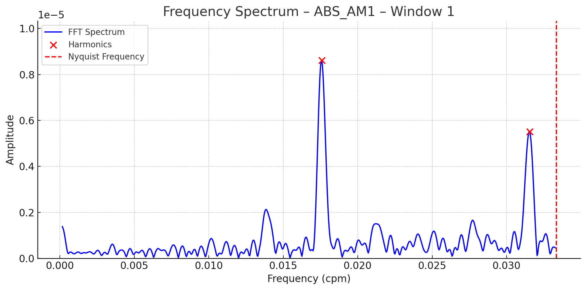
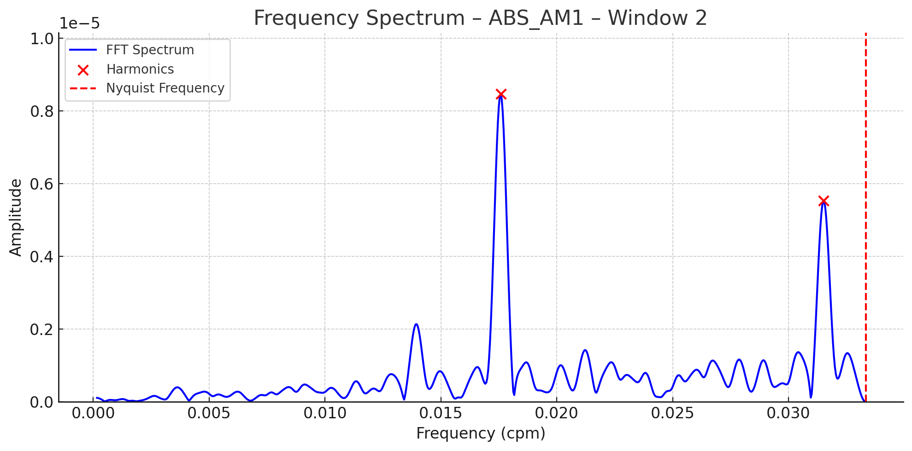
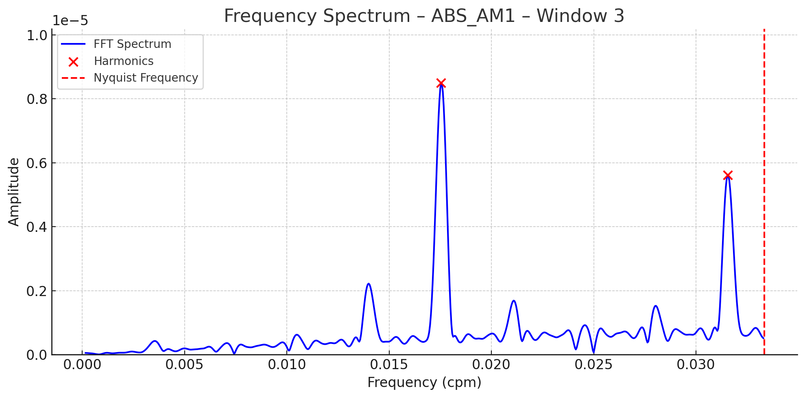

# Spectral Characterization of Smart Meter Errors Using STFT and FFT

Repository companion to the paper "*Spectral Characterization of Smart Meter Errors Using STFT and FFT*"  
**Authors**: Rui Pestana (NESTER), Pedro Costa (ISEL)  
**Affiliations**: Sacavém, Portugal | Lisboa, Portugal  
**Contact**: [rui.pestana@ren.pt](mailto:rui.pestana@ren.pt) | [A49803@alunos.isel.pt](mailto:A49803@alunos.isel.pt)

## Overview
This repository contains the implementation of a spectral analysis methodology for smart meter error signals, featuring:

- Short-Time Fourier Transform (STFT) with 50-hour sliding windows
- FFT-based spectral decomposition with harmonic analysis
- Autocorrelation-based fundamental frequency estimation
- Periodic structure identification in error signals

## Key Features
- **50-hour window STFT** with 25-hour step size
- **Multi-stage preprocessing**: Mean subtraction, Hamming window, zero-padding (8×)
- **Harmonic tracking** through integer multiples of f₀
- **Time-localized frequency analysis** for anomaly detection
- **Efficient implementation** using FFT algorithms

## Installation

## Methodology
1. **Signal Segmentation**: 50-hour windows with 25-hour overlap
2. **Preprocessing Pipeline**:
   - DC component removal
   - Hamming window application
   - Zero-padding (8× signal length)
3. **Spectral Decomposition**:
   - FFT computation
   - Autocorrelation-based f₀ estimation (≈1.25×10⁻⁵ Hz)
   - Harmonic component identification
4. **Time-Frequency Analysis**:
   - STFT spectrogram generation
   - Stability assessment of harmonic structures

## Results
  
 
 
*Typical output showing stable harmonic components at 22-24 hour periods*

## Contributors
- **Rui Pestana**  
  NESTER  
  Sacavém, Portugal  
  [rui.pestana@ren.pt](mailto:rui.pestana@ren.pt)

- **Pedro Costa**  
  ISEL - Instituto Superior de Engenharia de Lisboa  
  Lisboa, Portugal  
  [A49803@alunos.isel.pt](mailto:A49803@alunos.isel.pt)

## License
This project is licensed under the MIT License - see the [LICENSE](LICENSE) file for details.

## Citation
If you use this work in your research, please cite:
- **50-hour window STFT** with 25-hour step size
- **Multi-stage preprocessing**: Mean subtraction, Hamming window, zero-padding (8×)
- **Harmonic tracking** through integer multiples of f₀
- **Time-localized frequency analysis** for anomaly detection
- **Efficient implementation** using FFT algorithms

 
